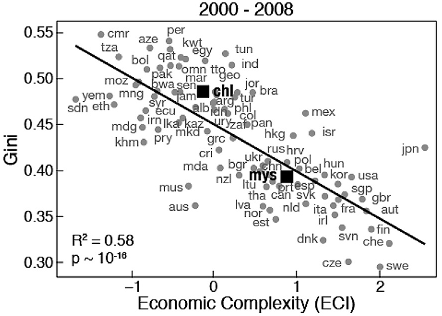
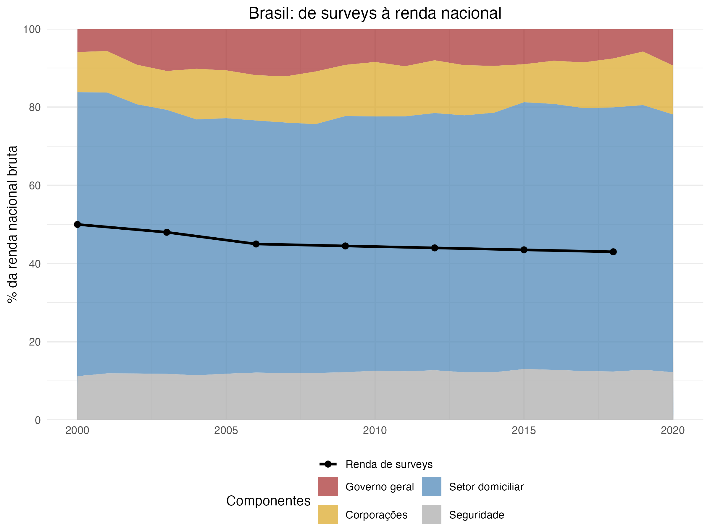
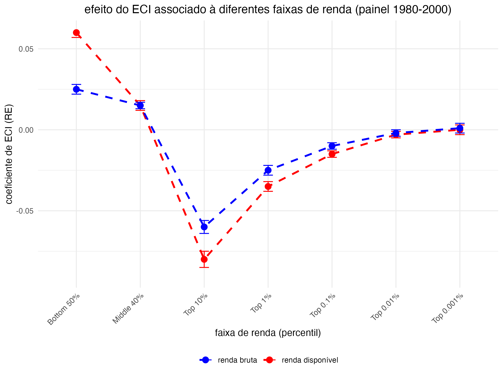
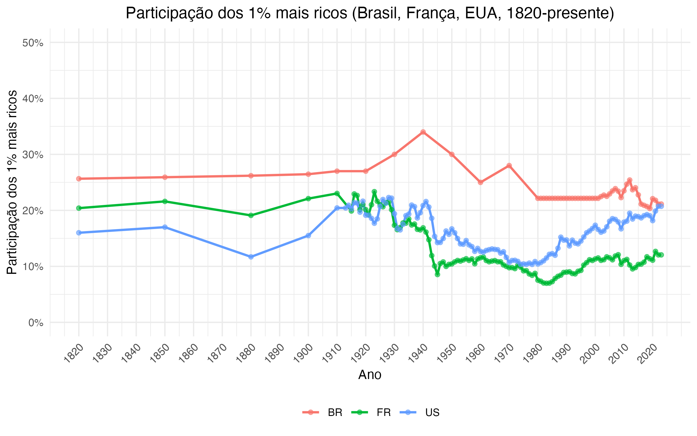
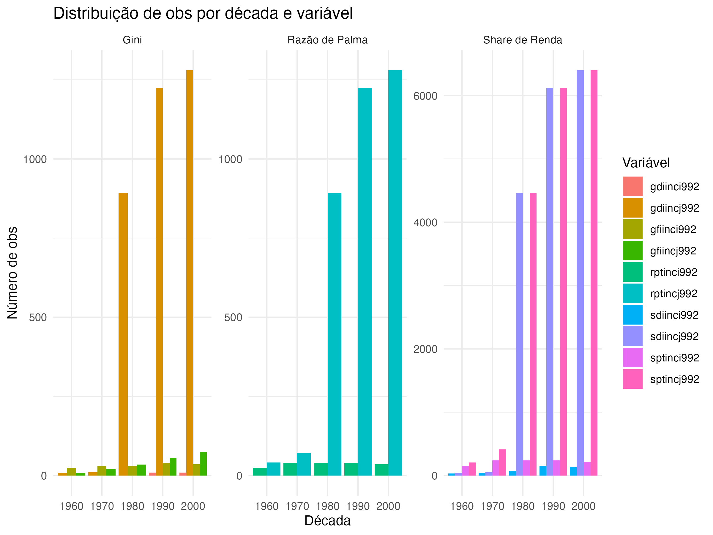
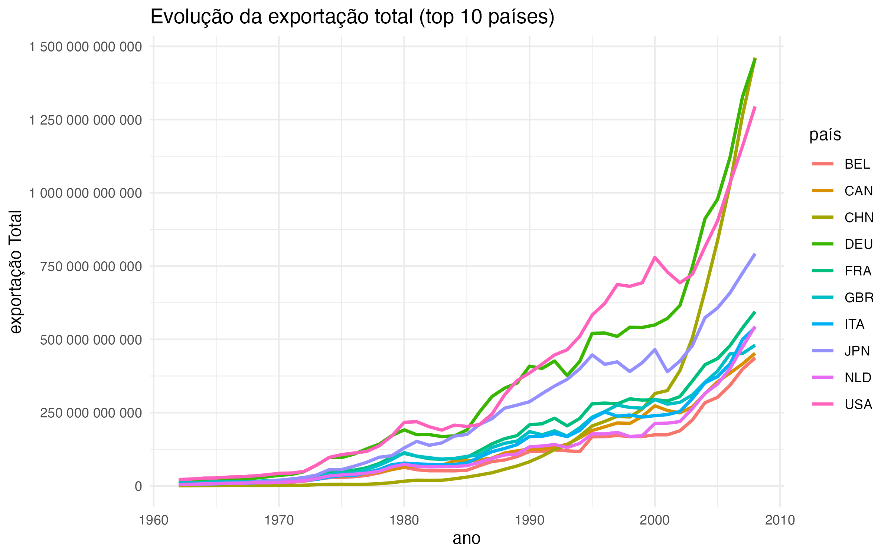
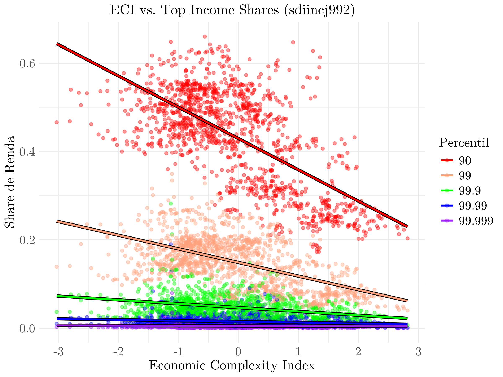

# Visão geral

Neste relatório, apresento como apliquei conceitos e técnicas aprendidas no curso *Ciência de Dados Avançada*, semestre 2024/2, em um projeto de pesquisa. Especificamente, os apliquei para produzir o artigo "Complexidade Econômica e Desigualdade de Renda: a vista do topo é diferente" [@Maia2025, de agora em diante, ***Projeto***], trabalho final da disciplina *Economia do Desenvolvimento*, cursada no mesmo semestre. O artigo pode ser acessado clicando [aqui](https://drive.google.com/file/d/1xuicRVD2I5QZdf2HObj_-TefAYSYd28O/view?usp=sharing){target="_blank"}.

Executei o ***Projeto*** em duas etapas: uma de **exploração, limpeza e estruturação dos dados**; outra dedicada à **análise e aos seus resultados**. Neste relatório **trato apenas da primeira parte**, pois  incluir também a fase de análise e resultados o tornaria excessivamente extenso.

Organizei o relatório da seguinte forma. Na @sec-projeto apresento uma visão geral do artigo. A exploração, limpeza e estruturação dos dados são objeto da @sec-execucao, ***Execução***. Na @sec-cozinha apresento a ***Cozinha de Pesquisa***, onde falo das limitações enfrentadas e aprendizado adquirido no processo. O relatório termina na @sec-appendix, com informações sobre a ***Repetibilidade*** (ou ***replicabilidade computacional***) das etapas do trabalho.

::: {style="height: 1px;"}
:::

------------------------------------------------------------------------

# Um *Projeto* sobre complexidade e desigualdade {#sec-projeto}

A **complexidade econômica** de um sistema é determinada por dois fatores principais: a *diversidade* e *ubiquidade* de seus produtos [@Hidalgo2007; @atlasEconomicComplexity]. A diversidade representa a variedade de produtos que um sistema -- no nosso caso, um país -- fabrica com vantagem comparativa; enquanto a ubiquidade mede quantos outros países também exportam esses produtos. Os dois fatores estão associados a um maior PIB per capita e ao crescimento econômico, especialmente em países que evoluíram de economias baseadas em recursos naturais para setores mais sofisticados. Para quantificar a complexidade econômica, César Hidalgo e Ricardo Hausmann desenvolveram o **Índice de Complexidade Econômica (ECI)** [@Hidalgo2009], desde então empregado numa série de investigações em economia.

Numa delas, @Hartmann2017 utilizaram a base de dados ***SITC, Rev. 2*** do ***Atlas of Economic Complexity (SITC 2)*** [@GrowthLab2019] como fonte de cálculo do ECI e identificaram uma associação negativa entre a complexidade e a  **desigualdade de renda**. Países de economia menos complexa tendem a ser mais desiguais, e quanto maior o grau de complexidade de um país, menor sua desigualdade de renda (veja a [Figura 1](#eci-gini-hartmann)). Desde então, diversos estudos testaram essa relação em diferentes contextos, especialmente regionais.

::: {style="height: 10px;"}
:::

::: {#eci-gini-hartmann .small-figure}
<p class="figure-caption-top">***Figura 1:*** *relação bivariada entre complexidade econômica e desigualdade de renda.*<br>***Fonte:*** *@Hartmann2017 [p. 78].*</p>

{fig-align="center" width=60% }

:::

::: {style="height: 10px;"}
:::


Apesar de sua relevância, há duas importantes limitações no modo como essa literatura tem concebido e medido a desigualdade. Nela, a desigualdade é frequentemente representada pelo **índice de Gini**, que não permite conhecermos qual a parcela da renda apropriada tanto pelas faixas mais pobres quanto pelas mais ricas da distribuição. Além disso, a principal fonte de dados das análises são pesquisas domiciliares, que **subestimam sistematicamente a concentração de renda no topo** [@Alvaredo2023]. Esse é o caso de Hartmann et al., que utilizaram os Ginis calculados pelo ***All the Ginis (ALG)*** e o ***Estimated Household Income Inequality Project (EHII)***, ambas as bases construídas principalmente a partir de surveys domiciliares. A **Tabela 1** (acesse <a href="table_gini.png" target="_blank">aqui</a>) sintetiza como essa literatura concebe a desigualdade, destacando as métricas e fontes de dados mais recorrentes.

Para superar esses problemas, pesquisadores têm calculado a desigualdade segundo a metodologia das ***Contas Nacionais Distributivas*** (da sigla em inglês, ***DINA***). As DINAs combinam dados de surveys domiciliares com registros tributários e administrativos, e procuram tornar os resultados compatíveis com as estimativas agregadas das contas nacionais [@piketty2018distributional]. Além de diminuir as dificuldades associadas a alcançar a concentração de renda no topo, isso permite calcular parcelas da renda total apropriadas por diferentes faixas da distribuição (e.g., 50% mais pobres, 10%, 1% e 0,1% mais ricos). Trabalhos baseados na DINA revelam como surveys capturam apenas uma fração da renda total. Como mostra a [Figura 2](#brasil_surveys), em países como o Brasil essa fração chega a apenas metade do total estimado. Estudos baseados na DINA sugerem que além da subestimação do nível da desigualdade, algumas de suas tendências podem ter sido diferentes do que pesquisas anteriores indicavam. Segundo @DeRosa2024, este é o caso de regiões como a América Latina.

::: {style="height: 10px;"}
:::

::: {#brasil_surveys .small-figure}
<p class="figure-caption-top">***Figura 2:*** *Componentes e faixa capturada pelos surveys domiciliares da renda nacional. Os resultados estão de<br>acordo com @DeRosa2024 [pp. 16].* ***Fonte:*** *@Maia2025 [p. 6] calculado com dados da WID.*</p>


:::

::: {style="height: 10px;"}
:::

Meu objetivo com o ***Projeto*** foi repetir a análise de Hartmann et al. utilizando dados da ***World Inequality Database (WID)***. A WID é construída pelo ***World Inequality Lab*** segundo a metodologia da DINA. Isso me permitiu examinar a relação da complexidade com a desigualdade de forma mais granular. No nível agregado meus achados reforçaram a relação negativa entre complexidade e desigualdade. Mas com os dados da WID também encontrei novos fatos estilizados. Primeiro, o efeito progressivo que acompanha a complexidade se concentra nos 90% inferiores da distribuição. Isso é particularmente forte entre os 50% mais pobres, cuja renda é a que mais cresce conforme a complexidade aumenta. A relação se torna negativa apenas dentro dos 10% mais ricos, mas aqui ela se torna regressiva. Quanto mais nos aproximamos do topo, menor é o efeito de redução da renda associado à mais complexidade. A partir do 1% mais ricos, isso praticamente desaparece. Esse padrão é representado na [Figura 3](#plot_foice) cuja estrutura assume a forma característica de foice. Ou seja, quando vista do topo, a relação entre estrutura produtiva e desigualdade não é nada homogênea.

::: {style="height: 10px;"}
:::

::: {#plot_foice .small-figure}
<p class="figure-caption-top">***Figura 3:*** *efeito da complexidade econômica associado a diferentes faixas de renda. Dados em painel para<br>múltiplos países no período 1980-2000.* ***Fonte:*** *@Maia2025 [p. 13] com dados da WID.*</p>


:::

::: {style="height: 10px;"}
:::

Dito isso, agora podemos falar dos conceitos e técnicas de ciência dos dados aplicadas no ***Projeto*** propriamente.

::: {style="height: 1px;"}
:::

------------------------------------------------------------------------

# Execução {#sec-execucao}

Estruturei a realização do ***Projeto*** em cinco etapas:

1)  **Exploração**: Exploração das bases de dados (WID e SITC 2) e compreensão de suas variáveis.
2)  **Limpeza e Estruturação**: Integração das bases e tratamento dos dados para análise.
3)  **Análises**: Execução de estatísticas descritivas, modelos de regressão e dados em painel.
4)  **Resultados**: Interpretação dos achados e comparação com a literatura existente.
5)  **Repetibilidade**: Documentação do processo e organização do código permitindo a replicabilidade computacional.

Tudo foi conduzido em R versão **4.4.1, 2024-06-14** [@Rlanguage]. Como mencionei na introdução, apenas as duas primeiras etapas são objeto deste relatório. De qualquer modo, o script usado na análise e obtenção dos resultados (`analysis-proper.R`) pode ser baixado clicando [aqui](analysis-proper.R){download="analysis-proper.R"}. Os detalhes sobre a repetibilidade dos resultados são tratadas na @sec-appendix.

::: {style="height: 1px;"}
:::

## Exploração dos Dados

O principal objetivo desta etapa construir uma base que reunisse os dados sobre complexidade do SITC 2 e aqueles de desigualdade da WID. Isso permitiria realizar as análises relevantes. Para isso, comecei explorando ambas as bases para entender suas características, variáveis e estruturas. Falemos sobre cada uma:

**World Inequality Database (WID):** A WID consiste em centenas de `.csv`, sendo pelo menos dois por país — um com os metadados e outros com os dados propriamente. Também há arquivos que agregam informações de regiões inteiras, como a América Latina e o Caribe ou a União Europeia. Em alguns casos, como China e Estados Unidos, há arquivos específicos com dados de subdivisões intranacionais. Encontramos estatísticas sobre desigualdade de renda, riqueza, população e agregados macroeconômicos para mais de 200 países e regiões, cobrindo diferentes períodos. A base completa pode ser baixada clicando neste [link](https://wid.world/data/). 

A WID é construída segundo a metodologia da DINA e, por meio de imputações, sempre fornece dados para todos os percentis da distribuição [@blanchet2024distributional]. Além disso, inclui variáveis associadas a diferentes conceitos de renda, como, por exemplo, *pré-tributação*, *pós-tributação* e *renda dos fatores*. A [*Tabela 2*](#table2) abaixo apresenta a estrutura dos códigos da WID (o dicionário de códigos pode ser acessado [aqui](https://wid.world/codes-dictionary/)). Para uma comparação entre a WID e outras bases de desigualdade, incluindo as utilizadas por @Hartmann2017, consulte a *Tabela 3* clicando <a href="table_db_md.png" target="_blank">aqui</a>.


::: {#table2 .small-table}
| **categoria**      | **código** | **significado**         |
|--------------------|------------|-------------------------|
| tipo               | `s`        | fração de renda         |
| tipo               | `g`        | coeficiente de Gini     |
| tipo               | `r`        | Razão de Palma          |
| conceito de renda  | `ptinc`    | nacional pré-tributação |
| conceito de renda  | `diinc`    | nacional pós-tributação |
| conceito de renda  | `fiinc`    | nacional fiscal         |
| unidade            | `j`        | "equal-split"           |
| idade              | `992`      | acima de 20 anos        |
| percentil de renda | `p99p100`  | 1% no topo              |

: ***Tabela 2:*** *Estrutura dos Códigos da WID.*<br>***Fonte:*** *@WIDCodesDictionary.*
:::

 

**SITC, Rev. 2 do Atlas of Economic Complexity (SITC 2):** O Atlas oferece bases sobre comércio internacional, crescimento econômico, e produtos e serviços classificados segundo a noção de complexidade econômica desenvolvida por Hidalgo e Hausmann [@atlasEconomicComplexity]. Uma apresentação curta sobre ele se encontra [aqui](https://atlas.hks.harvard.edu/about-data#data). Ele contém dados históricos de comércio bilateral para aproximadamente 700 produtos agrupados em 10 setores, cobrindo mais de 250 países e territórios desde 1962. As fontes do Atlas são dados da *United Nations Statistical Division (Comtrade)* e da *IMF Direction of Trade Statistics*. 

Os dados são estruturados segundo dois sistemas de classificação: *Harmonized System (HS 1992)* e a *Standard International Trade Classification (SITC, Rev. 2 ou SITC 2)*. Na SITC 2 [@SITC-2], os produtos são classificados em níveis de 1-, 2- ou 4-dígitos, mantendo consistência metodológica desde os anos 1960 – mesmo com o surgimento de novos produtos como, e.g., eletrônicos. Já a a base HS 1992 é mais granular. Ela inclui por volta de 5000 produtos (detalhados em 1-, 2-, 4- ou 6-dígitos), mas cobre um período mais curto, a partir de 1995. A [*Tabela 4*](#table4) abaixo apresenta a estrutura dos códigos da SITC 2. Em sua análise original, Hartmann et al. optaram pela SITC 2, pois ela permite estudos de mais longo prazo. Pela mesma razão, é ela a que empreguei aqui.

::: {#table4 .small-table}
| **categoria** | **código** | **significado** |
|-----------------|-----------------|--------------------------------------|
| país | `country_id` | código do país (M49 - ONU) |
| país parceiro | `partner_country_id` | código do país parceiro (M49 - ONU) |
| produto | `product_id` | identificador numérico do produto (Growth Lab) |
| ano | `year` | ano do registro |
| valor de exportação | `export_value` | valor exportado em dólares correntes |
| valor de importação | `import_value` | valor importado em dólares correntes |
| complexidade | `eci` | Índice de Complexidade Econômica (ECI-SITC) |
| complexidade | `coi` | Complexity Outlook Index (COI-SITC) |
| complexidade | `pci` | Índice de Complexidade do Produto (PCI) |

: ***Tabela 4:*** *Estrutura dos Códigos da SITC, Rev. 2.*<br>***Fonte:*** *@SITC-2.*
:::

::: {style="height: 1px;"}
:::

## Limpeza e Estruturação dos Dados

O processo de limpeza e integração dos dados da WID e da SITC 2 está documentado no script `wid-SITC-cleaning.R` (baixe [aqui](wid-SITC-cleaning.R){download="wid-SITC-cleaning.R"}). Resumidamente, nesta etapa segui estes seguintes passos:

(i) carregamento e combinação da WID; carregamento e agregação do STIC 2;
(ii) integração com informações sobre população; 
(iii) conversão de códigos de país; 
(iv) merge final (SITC 2 + WID); 
(v) checagem de consistência e salvamento.

Vejamos cada um deles com um pouco de detalhe.

::: {style="height: 15px;"}
:::

**i. Carregamento e Combinação da WID**

-   Todos os arquivos da WID foram lidos e concatenados em um único *data frame* (`wid_full`)cujo tamanho ultrapassaria 16 GB. Para otimizar essa etapa, utilizei processamento paralelo com a função `future_map_dfr()`, que aplica a função de leitura em múltiplos arquivos simultaneamente, distribuindo a carga entre núcleos disponíveis e combina os resultados em um único data frame.
-   A seguir, selecionei apenas as variáveis de interesse do ***Projeto:*** Gini, razão de Palma -- razão da renda apropriada pelos 10% mais ricos e os 40% mais pobres --, e renda apropriada por diferentes frações da distribuição -- 50% mais pobres, 40% intermediários, e 10%, 1%, 0,1%, 0,01%, 0,001% mais ricos (veja a [*Tabela 5*](#table5) abaixo).

::: {#table5 .small-table}
| **código** | **tipo** | **renda** | **percentis** |
|---------------|---------------|---------------|-----------------------------|
| `sptincj992` | fração | pré-tributação | `p050`, `p50p90`, `p90p100`, `p99p100`, `p99.9p100`, `99.99p100`, `99.999p100` |
| `sdiincj992` | fração | pós-tributação | `p050`, `p50p90`, `p90p100`, `p99p100`, `p99.9p100`, `p99.9p100`, `99.999p100` |
| `gptincj992` | Gini | pré-tributação | `p0100` |
| `gdiincj992` | Gini | pós-tributação | `p0100` |
| `rptincj992` | Palma | pré-tributação | `p0p40`, `p90p100` |
| `rdiincj992` | Palma | pré-tributação | `p0p40`, `p90p100` |

: ***Tabela 5:*** *Variáveis da WID selecionadas para o* ***Projeto***</span>
:::

 


-   Veja na [Figura 4](#plot_topshare) série de concentração no topo de Brasil, França e Estados Unidos e que ilustra o tipo de informação oferecida pelo WID.

::: {style="height: 10px;"}
:::

::: {#plot_topshare .small-figure}
<p class="figure-caption-top">***Figura 4:*** *participação dos 1% mais ricos na renda total (Brasil, França, EUA, 1820-presente). Os<br> resultados estão em linha com que está disponível na plataforma interativa do WID como<br>pode ser acessado [aqui](https://wid.world/share/#0/countriestimeseries/sptinc_p99p100_z/US;FR;BR/last/eu/k/p/yearly/s/false/5.6290000000000004/40/angle/false).* ***Fonte:*** *gerado no `wid-SITC-cleaning.R` com dados da WID.*</p>


:::

-   É importante ter em mente duas coisa. Além das variáveis distributivas, precisamos definir qual conceito de renda vamos utilizar. Dentre os diversos disponíveis na WID, optei pela renda pré-tributação (`ptinc`) e pela renda pós-tribução (`diinc`). Isso permitiria avaliar a interação da redistribuição de renda com a complexidade e desigualdade.

-   Segundo, é necessário estabelecer a unidade e a faixa etária das variáveis de desigualdade (veja a *Tabela 3*). Minha escolha foi orientada pela disponibilidade de dados. Como podemos ver na [*Figura 5*](#plot_obs_decade), a unidade "equal-split" (`j`), que divide a renda familiar igualmente entre adultos no domicílio, possui bem mais observações do que a unidade indivíduos (`i`). Além disso, veja a escassez de observações para todas as variáveis — Gini, Razão de Palma e frações ("shares") de renda — nas décadas de 1960 e 1970. Também observe como a quantidade de observações para frações de renda é bem superior do que para as outras duas variáveis.

::: {style="height: 10px;"}
:::

::: {#plot_obs_decade .small-figure}
<p class="figure-caption-top">***Figura 5:*** *distribuição de observações por década e variável.* ***Fonte:*** *gerado<br>no `wid-SITC-cleaning.R` com dados da WID.*</p>


:::

::: {style="height: 10px;"}
:::

-   Também selecionei as variáveis de *GDP* e *população*, também disponibilizadas na WID. Elas se faziam necessárias para o cálculo do PIB per capita, utilizado como controle na fase de análise.

-   Para evitar distorções causadas por arredondamento e garantir a correta intepretação das colunas com informações dos percentis (e.g., `p99p100`, `p90p100`), reorganizei e armazenei essas colunas como *strings*.

-   Finalmente, para permitir a recuperação do pipeline em diferentes estágios, gerei *data frames* intermediários e os salvei em formato `.csv` e `.rds`.

::: {style="height: 15px;"}
:::

**ii. Carregamento e Agregação do SITC 2**

-   Na SITC 2 fiz uso das seguintes variáveis: **ECI** (`avg_eci`), indicador de complexidade econômica médio do país, e **exportações e importações**. Essas variáveis foram relevantes porque Hartmann et al. limitaram sua análise a mais de 150 países que atendiam a dois critérios: população superior a 1,5 milhão de habitantes e volume de exportações acima de 1 bilhão de dólares.
-   Os dados estavam distribuídos em vários arquivos `.dta` (Stata), convertidos para `.csv` e `.rds`. Para cada arquivo, selecionei apenas as colunas relevantes: `country_id`, `year`, `export_value`, `import_value` e `eci`. Em seguida, agreguei os dados por país e ano, somando o total das exportações e calculando a média do ECI para cada país em cada ano. Isso me permitiu, e.g., gerar a [*Figura 6*](#10exporters) que mostra a evolução das exportações nos 10 países com os maiores volumes comerciais ao longo do tempo.

::: {style="height: 10px;"}
:::

::: {#10exporters .small-figure}
<p class="figure-caption-top">***Figura 6:*** *evolução da exportação total (top 10 países).* ***Fonte:*** *gerado<br>no `wid-SITC-cleaning.R` com dados do SITC 2.*</p>


:::

::: {style="height: 10px;"}
:::

-   Devido ao grande volume de dados, também fiz uso de processamento em blocos e funções paralelas para otimizar a execução e evitar o consumo excessivo de memória.
-   O resultado foi um *data frame* estruturado com uma linha para cada combinação de país e ano, contendo o ECI médio e o total de exportações.

::: {style="height: 15px;"}
:::

**iii. Integração com Informações de População (Banco Mundial)**

-   Embora o SITC 2 contenha dados sobre volume de exportações, ele não inclui informações sobre população, que são essenciais para atender ao segundo critério de Hartmann et al. Por isso, integrei ao *data frame* informações sobre população do Banco Mundial (disponível para baixar [aqui](<https://data.worldbank.org/indicator/SP.POP.TOTL>)).
-   Para padronizar os dados, converti o formato largo para longo (`pivot_longer()`) e mantive apenas anos de interesse.

::: {style="height: 15px;"}
:::

**iv.  Conversão de Códigos e Filtragem de Países**

- A padronização dos códigos de país foi um passo essencial para permitir a integração dos diferentes conjuntos de dados. A WID utiliza códigos ISO2 (BR, US, FR, etc.), enquanto o SITC 2 emprega códigos numéricos ISO e M49 da ONU (76, 840, 250, etc.).
- Para harmonizar essas diferenças, utilizei a função `countrycode()` convertendo todos os códigos para o padrão ISO3 (BRA, USA, FRA, etc.). Isso garantiu a compatibilidade necessária para realizar junções (`left_join` ou `inner_join`) pelo identificador `country_id`.
- Além disso, excluí códigos correspondentes a regiões agregadas ou subdivisões de países que não eram relevantes para a análise, como `US-AL` (Alabama, EUA), `DE-BY` (Baviera, Alemanha), `ARB` (países árabes) e `EUU` (União Europeia).

::: {style="height: 15px;"}
:::

**v. Merge Final (SITC 2 + WID)**

-   Feita a padronização, o "merge" ou junção final uniu as variáveis de desigualdade (WID) e as variáveis de complexidade e fluxos comerciais (SITC 2), utilizando "country-year" como chave.
-   Nessa etapa, identifiquei a presença de diversos valores ausentes (NAs) e outliers. Após uma análise de robustez, optei pela remoção desses casos para garantir a consistência dos dados.

::: {style="height: 15px;"}
:::

**vi. Checagem de Consistência e Salvamento da Versão Final**

-   Conferi a quantidade de observações no data frame final e avaliei a distribuição temporal dos dados, analisando a quantidade de registros por década e por país para identificar possíveis lacunas ou inconsistências.
Calculei estatísticas descritivas (médias, desvios-padrão) para validar se os valores de ECI, Gini, participação do topo, entre outros, estavam alinhados com expectativas da literatura.
-   Finalmente, armazenei o *dataset* resultante eno objeto `combined_sitc_wid` e salvei versões em `.csv` e `.rds`. Isso me possibilitaria realizar as análises e produzir os resultados, que seriam objeto das etapas posteriores (vide o script `analysis-proper.R`).

## Conceitos e técnicas de ciência dos dados aplicadas

Nesta seção descrevo brevemente os conceitos e técnicas da disciplina *Ciência dos Dados Avançada* empregados durante a exploração e limpeza dos dados do ***Projeto***. Em poucas palavras, fiz uso intensivo de programação funcional, paralelização, manipulação avançada de dados, estruturação e visualização de dados. A seguir, cada conceito e técnica é acompanhada de exemplos práticos de código R.

- **Programação Funcional e Criação de Funções:** Desenvolvi funções especializadas para operações-chave como `process_wid_file()`  que automatiza a leitura e transformação de dados a partir de múltiplos arquivos `list.files()`. Essa abordagem funcional, combinada com operações do `dplyr` (como `mutate`, `group_by`), permitiu: reusabilidade, pelo tratamento uniforme de diferentes fontes de dados; manutenção simplificada, pelo isolamento de lógicas complexas em unidades modulares; e eficiência, pela aplicação vetorizada de transformações em *data frames*.


::: {.cell}

```{.r .cell-code}
# Uso de programação funcional para ler múltiplos arquivos (funções, loops, paralelismo)

process_wid_file <- function(file_path) {
  # Lê e manipula colunas necessárias
  df <- readr::read_delim(file_path, delim = ";", show_col_types = FALSE) %>%
    dplyr::select(country, variable, percentile, year, value) %>%
    dplyr::mutate(
      lower_percentile = stringr::str_remove(
        stringr::str_extract(percentile, "^p[0-9\\.]+"), "^p"
      ),
      upper_percentile = stringr::str_remove(
        stringr::str_extract(percentile, "p[0-9\\.]+$"), "^p"
      )
    )
  return(df)
}
```
:::


-   **Paralelização:** Empreguei a função `future_map_dfr()`, do pacote `furrr`, para processamento paralelo, tornando a execução mais eficiente.


::: {.cell}

```{.r .cell-code}
# Paralelizando a leitura de arquivos com 'future_map_dfr()'
future::plan("multisession", workers = 4)

wid_files <- list.files(path = "data/wid_all_data", pattern = "\\.csv$", full.names = TRUE)
wid_full <- furrr::future_map_dfr(wid_files, process_wid_file)
```
:::


- **Manipulações Avançadas com `dplyr`:** Usei intensivamente verbos como `select`, `filter`, `mutate`, `group_by` e `summarise`. Isso foi objeto do tópico de ***Principais Bibliotecas de Ciência de Dados*** do curso.


::: {.cell}

```{.r .cell-code}
# Uso de funções do dplyr para limpeza
wid_filtered <- wid_full %>%
  dplyr::filter(variable %in% c("sptincj992", "sdiincj992", "gptincj992", "gfiincj992")) %>%
  dplyr::filter(!is.na(value), lower_percentile %in% c("99", "0")) %>%
  dplyr::mutate(lower_percentile = as.numeric(lower_percentile),
                period_flag = ifelse(year >= 1980, TRUE, FALSE))
```
:::


- **Estruturação e Limpeza dos Dados:** Transformei e organizei os dados, convertendo variáveis textuais para numéricas, criando novas variáveis úteis como `decade` e `period_flag`. Também removi dados faltantes (*NAs*) e valores extremos (*outliers*), o que está de acordo com os ***Conceitos de Limpeza e Organização de Dados***.


::: {.cell}

```{.r .cell-code}
# Sumarizar e agrupar observações por país e ano
wid_summary <- wid_filtered %>%
  dplyr::group_by(country, year) %>%
  dplyr::summarise(
    mean_value = mean(value, na.rm = TRUE),
    n_obs = dplyr::n(),
    .groups = "drop"
  ) %>%
  dplyr::mutate(decade = floor(year / 10) * 10)

# Exibindo algumas linhas do resultado
head(wid_summary)
```
:::


- **Visualização e Ferramentas Estatísticas:** Finalmente, utilizei técnicas estatísticas, como regressões lineares (`lm()`), e gerei visualizações com `ggplot2`. Para garantir clareza e qualidade, os gráficos foram exportados com o pacote `tikz`, o que permitiu uma representação vetorial precisa e alinhada com alguns dos princípios de comunicação visual eficaz discutidos durante o curso.


::: {.cell}

```{.r .cell-code}
# Gera e exporta gráfico de correlação ECI-share de renda usando ggplot2 + tikz

# Dados filtrados para um ano/década
dados_plot <- data %>%
  filter(decade == 2000, 
         wid_variable == "top_income_share") %>%  # ajustar conforme nome da variável
  drop_na(avg_eci, wid_value) %>%
  mutate(percentil = factor(lower_percentile,  # converter para fator com labels
                            levels = c(90, 99, 99.9, 99.99, 99.999),
                            labels = c("90", "99", "99.9", "99.99", "99.999"))

# Cores
cores_percentis <- c(
  "90" = "#8B0000", # vermlho
  "99" = "#D2B48C", # marrom
  "99.9" = "#228B22", # verde
  "99.99" = "#00008B", # azul
  "99.999" = "#800080" # roxo
)

plot_final <- ggplot(dados_plot, aes(x = avg_eci, y = wid_value)) +
  geom_point(aes(color = percentil), alpha = 0.7, size = 2.5) +
  geom_smooth(aes(color = percentil), method = "lm", formula = y ~ x, 
              se = FALSE, linewidth = 0.8) +
  scale_color_manual(values = cores_percentis) +
  labs(
    x = "Economic Complexity Index (ECI)",
    y = "Share de Renda no Topo",
    color = "Percentil:",
    caption = "Fonte: WID e SITC 2"
  ) +
  theme_minimal(base_size = 12) +
  theme(
    legend.position = c(0.85, 0.85),  # posição da legenda
    legend.background = element_rect(fill = "white", color = "gray80"),
    panel.grid.minor = element_blank(),
    axis.title = element_text(face = "bold")
  )

# Exportar com tikz
tikz(file = "figura7_correlacao.tex", 
     width = 7, 
     height = 5,
     sanitize = TRUE)
print(plot_final)
dev.off()
```
:::


- Uma ilustração disso é a [Figura 7](#correlacao_eci_sdiincj992), que mostra como a associação entre ECI e desigualidade se torna regressiva entre os 10% mais ricos -- isto é, os efeitos associados ao ECI diminuem à medida que nos aproximamos das faixas mais elevadas da distribuição.

::: {style="height: 10px;"}
:::

::: {#correlacao_eci_sdiincj992 .small-figure}
<p class="figure-caption-top">***Figura 7:*** *correlação simples do ECI e diferentes parcelas da renda apropriadas pelas faixas do topo, visualizada<br>com pacote `tikz`.* ***Fonte:*** *gerado no `wid-SITC-cleaning.R` com dados do WID e do SITC 2.*</p>


:::

::: {style="height: 10px;"}
:::

# "Cozinha de Pesquisa": limitações e aprendizado {#sec-cozinha}

A primeira lição foi sobre o desenho (ou "workflow") do ***Projeto***. Cabe aqui distinguir "pipeline" de "workflow." A "pipeline" é "aquilo que faz um computador, como por exemplo quando um pedaço de software roda de maneira automática uma série de scripts Bash ou R. Já  "workflow" se refere ao que o pesquisador faz para avançar em questões científicas, tais como desenvolver hipóteses, tratar dados, escrever código e interpretar resultados [ambas citações de @Stoudt2021].

A estratégia inicial (e um tanto óbvia) de dividir o processo em três etapas — conhecer a base, limpá-la e estruturá-la, e então partir para as análises — funcionou razoavelmente bem. Isso apesar do esperado vai e volta constante. Por exemplo, percebi tardiamente que decisões tomadas na fase inicial de limpeza excluíam variáveis importantes para a análise. Resultado: precisei voltar para a etapa de limpeza e refazer parte da "pipeline". De fato, ao longo do ***Projeto***, o principal desafio foi, sem dúvidas, limpar e integrar consistentemente as bases da WID e do STIC 2. Aliás, vale notar que a documentação dessas bases, especialmente o dicionário de variáveis da WID [@wid_codes_dictionary], é relativamente clara. Porém, nomes das variáveis na WID não são imediatamente intuitivos. O que exigiu uma curva um tanto íngreme de adaptação.

Algumas lições técnicas valem o registro. Uma das principais foi o tratamento dos percentis extremos (99.9%, 99.99%, 99.999%). Inicialmente, o R interpretou incorretamente esses valores numéricos, truncando as casas após a vírgula. Só após inconsistências nas análises percebi o erro: valores como 99.9 ou 99.999 eram tratados simplesmente como 99. A solução foi converter os percentis (`numeric`) para texto (`character`) antes do processamento, preservando assim sua precisão original.

Outro ponto curioso, e até irônico, é que a cobertura da *World Inequality Database* é bastante desigual. Das mais de 57 milhões de observações, os Estados Unidos sozinhos possuem mais de 800 mil, enquanto o Brasil tem cerca de 250 mil e o Vietnã menos de 650. Além disso, a maior parte dos dados está concentrada nos últimos 40 anos, o que inviabilizou iniciar a análise em 1960, como em Hartman et al. Diante disso, optei por trabalhar com observações de 1980 até o final dos anos 2000, focando em variáveis de renda bruta e líquida, além da unidadade de análise "equal-split".[^1]

[^1]: A WID contém um total de 57.208.488 observações distribuídas entre 1.793 variáveis, cobrindo o período de 1807 a 2023. A média dos anos com observações na base é 1999, com um desvio padrão de 20 anos. O primeiro quartil (Q25) corresponde ao ano de 1990, a mediana situa-se em 2002 e o terceiro quartil (Q75) em 2012. O número de anos com dados disponíveis por país também varia consideravelmente: o mínimo é 43 anos, enquanto o máximo chega a 214. Em média, cada país possui informações cobrindo 87 anos, com os seguintes quartis: Q25 = 44 anos, Q50 = 74 anos e Q75 = 95 anos.

Uma segunda lição foi sobre a tensão entre granularidade e viabilidade computacional. Embora a WID permita análises detalhadas em micropercentis, um tal uso se mostrou impraticável dado o cronograma do ***Projeto***. Num teste inicial com apenas 10% dos dados, o processamento levou várias horas, mesmo utilizando 7 dos 8 núcleos da CPU. Optei então por um exercício simplificado, agregando os dados da WID em decis. Embora os resultados tenham confirmado as tendências esperadas, acabei deixando esse exercício fora do artigo final por não ter realizado testes sobre sua robustez. Técnicas mais sofisticadas certamente ajudariam a otimizar o tempo de processamento, mas eu simplesmente ainda não as domino.

Finalmente, outra lição foi sobre o uso de processamento paralelo e replicabilidade. Para assegurar que o código rode consistentemente em diferentes máquinas, percebi que é essencial adaptar os scripts às limitações computacionais específicas de cada ambiente. Uma solução prática que identifiquei é utilizar funções como `parallel::detectCores()`, que permitem verificar o número de núcleos disponíveis antes de definir o número de *workers*, evitando que o código tente usar mais recursos do que a máquina suporta. Técnicas como **compartimentalização** (*Docker*) - encorajada inclusive na economia [@AEADocker2021] - também podem ajudar significativamente esse tipo de processo. Isso certamente será uma boa prática para garantir a replicabilidade computacional de meus futuros projetos.

# Repetibilidade {#sec-appendix}

Durante a realização do ***Projeto*** me preocupei em garantir que suas etapa pudessem ser repetidas por outros pesquisadores -- incluindo eu mesmo no futuro. Aliás, uma nota de vocabulário me parece em ordem. 

Segundo relatório da *National Academies of Science* [-@rrc2019], é útil distinguir ***repetibilidade*** de ***replicabilidade***. A primeira envolve a obtenção de resultados consistentes utilizando exatamente o mesmo ambiente computacional. Por isso também podemos chamá-la de **reprodutibilidade ou replicabilidade computacional**. Já a segunda, também chamada de **reprodutibilidade** *simpliciter*, implica obter resultados consistentes em novos estudos que buscam responder à mesma questão científica, mas com dados coletados de forma independente.

Nesses termos, para garantir a **repetibilidade** da exploração, limpeza e estruturação dos dados, acesse o **Apêndice** clicando [aqui](repetibilidade.html). Nele você poderá baixar o script `wid-SITC-cleaning.R` além de encontrar informações sobre o ambiente computacional e os pacotes necessários para executá-lo.

::: {style="height: 1px;"}
:::

------------------------------------------------------------------------

# Agradecimentos {.unnumbered .appendix}

Agradeço a Mateus Leite pela valiosa ajuda na criação dos códigos em R. Mas claro, tanto a falta de elegância quanto eventuais falhas em seu funcionamento ficam por minha conta.

::: {style="height: 1px;"}
:::

------------------------------------------------------------------------
